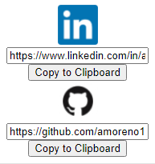

# JobClickBoard Chrome Extension

JobClickBoard is a Chrome extension that allows users to conveniently manage and copy their LinkedIn and GitHub profile links. Save your profile links and copy them to the clipboard with a click of a button.

## Features

- **LinkedIn Profile Link:** Enter your LinkedIn profile link and copy it to the clipboard.
- **GitHub Profile Link:** Enter your GitHub profile link and copy it to the clipboard.
- **Persistent Storage:** Your profile links are stored in Chrome's storage, so they persist across sessions.

## How to Use

1. Install the extension in Chrome.
2. Open the extension popup by clicking on the extension icon.
3. Enter your LinkedIn and GitHub profile links.
4. Click the "Copy to Clipboard" button for each link.
5. Your links are now saved and can be easily copied whenever needed.

## Installation

1. Clone this repository or download the ZIP file.
2. Open Chrome and navigate to `chrome://extensions/`.
3. Enable "Developer mode" in the top right.
4. Click "Load unpacked" and select the directory containing the extension files.

## Screenshots

## Contributing

Contributions are welcome! If you have suggestions or find issues, please open an issue or create a pull request.

---

**Disclaimer:** This extension is a basic example and may not cover all edge cases. Use it at your own discretion.
